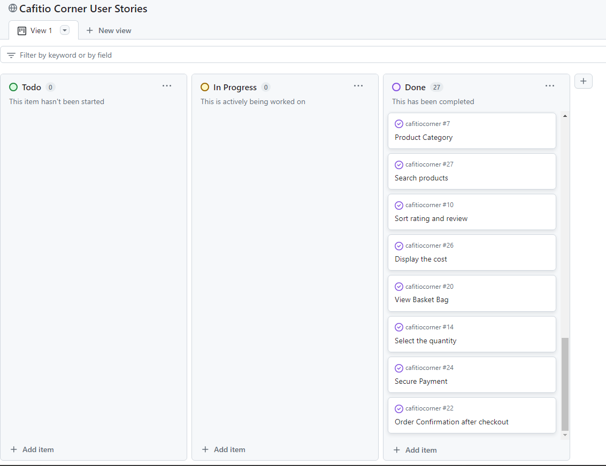
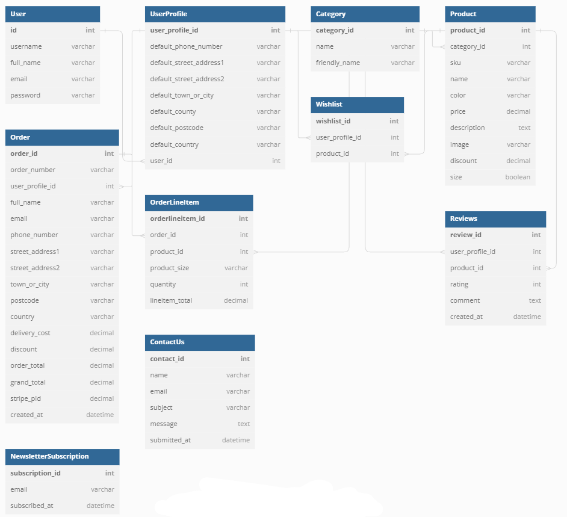

Welcome to Cafitio Corner. The place where you can buy coffee, coffee machines, and accessories to have a professional coffee experience at your home. Whether you're a casual coffee drinker or a connoisseur, this website caters to all types of coffee enthusiasts.

The purpose of the website is to offer high-quality coffee products and accessories. It provides a convenient platform for purchasing coffee-related items. Additionally, it aims to educate and inspire coffee enthusiasts to enhance their at-home coffee experience.

Image. To add.

[Live Website](https://cafitio-corner-5f01d0c35567.herokuapp.com/)
[GitHub Repository](https://github.com/terintealexandrin18/cafitiocorner)

## Table of Contents

1. User Experience (UX)
    i. Strategy
        a. Project Goals
        b. User Goals
        c. Strategy Table
    ii. Scope
        a. User Stories
    iii. Structure
        a. Database Model
    iv. Skeleton
        a. Wireframes
    v. Surface
        a. Color Scheme
        b. Typography
2. Marketing
    i. Search Engine Optimization
    ii. Business Model
3. Features
    i. Home Page
    ii. Products Page
    iii. Product Details Page
    iv. Products Admin
    v. Shopping Cart Page
    vi. Checkout Page
    vii. Checkout Success Page
    viii. Profile Page
    ix. Wishlist Page
    x. Reviews Page
        a. Add Review
        b. Edit Review
    xi. Contact Us Page
    xii. Accounts Pages
    xiii. 404 Error Page
4. Technologies Used
    i. Languages Used
    ii. Libraries and Frameworks
    iii. Packages / Dependencies Installed
    iv. Database Management
    v. Payment Service
    vi. Cloud Storage
    vii. Tools and Programs
5. Testing
    i. Go to TESTING.md
6. Deployment
    i. How To Use This Project
    ii. Deployment to Heroku
    iii. AWS Bucket Creation
    iv. Connect Django to AWS Bucket
7. Finished Product
8. Credits
9. Known Bugs
10. Acknowledgements

## User Experience (UX)
### Strategy
#### Project Goal
- Provide a Seamless User Experience: Ensure the website is user-friendly, intuitive, and accessible on all devices.
- Showcase Products Effectively: ighlight coffee products, machines, and accessories with high-quality images, detailed descriptions, and user reviews.
- Streamline the Purchase Process: Simplify the shopping cart and checkout process to reduce cart abandonment and increase conversions.
- Engage and Retain Customers: Implement features like user accounts, wishlists, and newsletters to foster customer loyalty.
- Optimize for Search Engines: Use SEO best practices to increase visibility and attract more potential customers. 

#### User Goal
## User Goals

- Epic 1 - User Account Management
  - Access and Edit User Profile
    - As a site user, I want to maintain my profile information to ensure it is current and accurate.

  - Account Management
    - As a site user, I want to set up an account to enable order placements and access additional features.
    - As a site user, I want to efficiently log in and out for seamless access to my profile.
    - As a site user, I want to review my order history to keep track of my previous purchases.
    - As a site user, I want to restore access to my account by resetting my password if needed.

- Epic 2 - Product Management
  - Product Management for Site Owner
    - As a site owner, I want to remove unavailable products to keep the store offerings relevant.
    - As a site owner, I want to update product details to ensure customers have accurate information.
    - As a site owner, I want to add new products to broaden the store's inventory.

  - Product Interaction for Site Users
    - As a site user, I want to browse through all products to find items that suit my needs.
    - As a site user, I want to view larger images and detailed descriptions to make informed purchasing decisions.
    - As a site user, I want to filter products by categories to easily find what I am looking for.
    - As a site user, I want to search for specific products quickly by name or description.

- Epic 3 - Shopping Experience
  - Order Confirmation
    - As a shopper, I want to receive an email confirmation to verify that my order was successfully placed.
    - As a shopper, I want to review my order details after checkout for accuracy and records.

  - Basket and Checkout
    - As a user, I want to add multiple items to my basket to facilitate a single transaction.
    - As a shopper, I want my personal details to be saved during checkout for faster future purchases.
    - As a shopper, I want my personal and payment information to be securely processed to protect my data.
    - As a shopper, I want to see the total cost of items in my basket at any time to manage my spending.
    - As a shopper, I want to adjust the quantity of items in my basket for accurate order fulfillment.
    - As a site user, I want to add multiple units of the same product to my basket to simplify bulk purchases.

- Epic 4 - Product Reviews and Ratings
  - Product Reviews and Ratings
    - As a shopper, I want to give ratings to products to share my experience with other shoppers.
    - As a site user, I want to manage my reviews by editing or deleting them to ensure they reflect my current opinions.
    - As a site user, I want to read reviews from others to help inform my buying decisions.
    - As a shopper, I want to sort reviews to quickly find the most relevant or recent feedback.

- Epic 5 - Newsletter Subscription
  - Newsletter Subscription
    - As a site owner, I want to provide a newsletter subscription to keep users informed about new products and offers.

- Epic 6 - Miscellaneous
  - Category and Search
    - As a shopper, I want to compare products across different categories to find the best options for my needs.

- Additional Features
  - The following feature was added after the initial user stories were completed:
    - As a site user, I want to add items to a wishlist to save them for future consideration.
    - As a site user, I want to view my wishlist to see the items I have saved.
    - As a site user, I want to remove items from my wishlist to manage my saved products effectively.

####  Strategy Table

| Opportunity / Problem / Feature                  | Importance | Viability / Feasibility |
|--------------------------------------------------|------------|-------------------------|
| Account signup                                   | 5          | 5                       |
| User profile                                     | 5          | 5                       |
| Responsive design                                | 5          | 5                       |
| Add products to the basket                       | 5          | 5                       |
| Make payment for selected products               | 5          | 5                       |
| Rate products                                    | 5          | 4                       |
| Add, edit, and delete reviews                    | 5          | 5                       |
| View product reviews                             | 5          | 5                       |
| Search for products                              | 5          | 5                       |
| View product details                             | 5          | 5                       |
| View order confirmation after checkout           | 5          | 5                       |
| Newsletter subscription                          | 5          | 5                       |
| Add products to wishlist                         | 5          | 5                       |
| View wishlist                                    | 5          | 3                      |
| Remove products from wishlist                    | 5          | 3                       |
| **Total**                                        | **75**     | **70** 

### Scope
The project aims to develop an e-commerce website, Cafitio Corner, offering a wide range of coffee products, machines, and accessories to customers. The website will be responsive and user-friendly, providing users with the ability to:

- User Authentication:
  - Register and create a user account
  - Login and logout seamlessly
  - Reset passwords

- Product Browsing and Management:
  - Browse and search for products by name or description
  - View detailed product information including images, descriptions, prices, and stock levels
  - Sort products by different criteria such as price, ratings, and categories
  - Add products to a shopping cart and manage quantities
  - Add products to a wishlist for future reference

- User Profile Management:
  - Access and edit user profile information
  - View past orders and order history
  - Save personal details for a streamlined checkout experience

- Reviews and Ratings:
  - Leave, edit, and delete product reviews
  - Rate products to provide feedback based on user experience
  - View product reviews from other users to make informed purchasing decisions

- Checkout and Payments:
  - Securely pay for products using integrated payment systems
  - Receive order confirmation via email after successful checkout

- Wishlist Management:
  - Add products to a wishlist for future reference
  - View and manage wishlist items, including the ability to remove products from the wishlist

- Newsletter Subscription:
  - Subscribe to a newsletter to stay updated with the latest products, offers, and coffee-related content

- Admin Functionality:
  - Add, edit, and delete products to maintain up-to-date offerings
  - Manage product stock levels
  - Access and update order statuses
  - Sort orders by status (In Progress, Completed, Cancelled)

Key Features

- Initial Project Setup:
  - Developers can set up a new Django project to create the project's structure.
  - Connect database and media storage for efficient data management.
  - Early deployment of the application to ensure functionality and initial setup.

- Products:
  - Users can view and refine products by all available categories.
  - Sort products by price, title, or category.
  - View detailed product information including image, description, price, stock level, reviews, and rating.
  - Registered users can leave reviews and ratings.

- User Authentication:
  - Account registration for full website functionality access.
  - Login to access wishlist, reviews, past orders, and saved personal details.
  - Password reset functionality.
  - Manage wishlist, adding or removing products.
  - Add or edit product reviews.

- Orders and Checkout:
  - Add products to the shopping cart.
  - Update product quantities in the shopping cart.
  - Remove products from the shopping cart.
  - Secure checkout functionality for payments.

- Admin Functionality:
  - Add new products for sale.
  - Delete products from the system.
  - Edit products and stock levels.
  - Access orders to update order status.
  - Sort orders by status (In Progress, Completed, Cancelled).

- Notification Messages:
  - Users will receive notification messages for CRUD operations, login/logout, and signup actions.

#### User Stories

Throughout the project, I utilized the GitHub Kanban board extensively to manage user stories effectively. This approach facilitated the prioritization of tasks and provided a clear visualization of the project's progress at every stage.

- Kanban Board - halfway through

Kanban Board - final stage

- As a site user, I can easily access my user profile and make necessary edits to ensure all information is kept up to date.

- As a shopper, I want to receive the order confirmation by email so that it will prove that the order has been successfully placed.

- As a site user, I can create an account so that I can place orders.

- As a site owner, I can delete products so that I ensure the store offers only available items to the customers to browse and purchase.

- As a site owner, I can edit the products so that I provide up-to-date information for the customers.

- As a shopper, I want to rate products so that I can provide specific feedback based on my experience, helping other shoppers make informed decisions.

- As a site user, I can leave, edit, and delete the reviews I've submitted so that I can share my experiences accurately and manage my feedback as needed.

- As a site user, I can view product reviews from other users to make informed decisions before purchasing.

- As a site user, I can easily reset the password in case I forget it so that I can have access to my account.

- As a site user, I can seamlessly log in and log out so that I can access my profile whenever needed.

- As a site user, I can access my account so that I can see the order history.

- As a site owner, I can add new products so that I expand the store offerings.

- As a site user, I want to view all the products so that I can choose what to purchase.

- As a shopper, I want the convenience of having my personal details saved in the checkout form so that future purchases are streamlined.

- As a site user, I can easily click on a product to view so that I can see the product image bigger and the product description.

- As a user, I can add multiple products to the basket so that I can make a single payment.

- As a site user, I can access the product description so that I can gather essential information about the product before making a decision.

- As a shopper, I want to add multiple categories of products simultaneously so that I can compare prices or ratings across diverse products.

- As a site user, I can select what category of products I want to see so that I can view only the category needed.

- As a user, I want to be able to search for product names or descriptions so that I can quickly locate the specific items I wish to purchase.

- As a shopper, I want to sort ratings and reviews so that I can quickly identify the higher ratings and newest reviews.

- As a shopper, I want to effortlessly view the total amount of the items in my basket at any time so that I can manage my budget.

- As a shopper, I can view and update the basket items quantity so that I can have control over my shopping.

- As a site user, I can add multiple quantities of the same product to the basket, so that will facilitate bulk purchases and simplify my shopping experience.

- As a shopper, I want assurance that my personal and payment information is secure so that I can confidently complete purchases.

- As a shopper, I want to view the order confirmation after the checkout so that I can review the items I ordered.

- As a site owner, I want to offer newsletter subscriptions to users so that we can ensure ongoing communication, sharing offers and inspiration, thereby encouraging their return visits.

### Structure

- The header, footer, and navigation bar are consistent across all pages, ensuring a seamless user experience.
- Links and forms provide clear feedback to the user, enhancing usability and interaction.
- Additional content features become available to shoppers once they register an account, providing a more personalized experience.
- A 404-error page is in place to handle any incorrect or broken links, guiding users back to the main content.

#### Database Model
 
 - The database model has been designed using [dbdiagram.io](https://dbdiagram.io). A relational database is used for the project, managed with SQLite3 during development and deployed using [PostgreSQL](https://www.postgresql.org/) in the production environment.

### Skeleton

 - The wireframes for the project were created using [Balsamiq](https://balsamiq.com). These wireframes helped in planning the layout and user interface of the website effectively.

| Page              | Desktop Version                                                   | Mobile Version                                                   |
|-------------------|-------------------------------------------------------------------|------------------------------------------------------------------|
| **Home**          |                |                 |
| **Products**      |        |         |
| **Product Details** |  |  |
| **Bag**           |                  |                   |
| **Checkout**      |        |         |
| **Checkout Success** |  |  |
| **Contact**       |          |           |
| **About**         |              |               |
