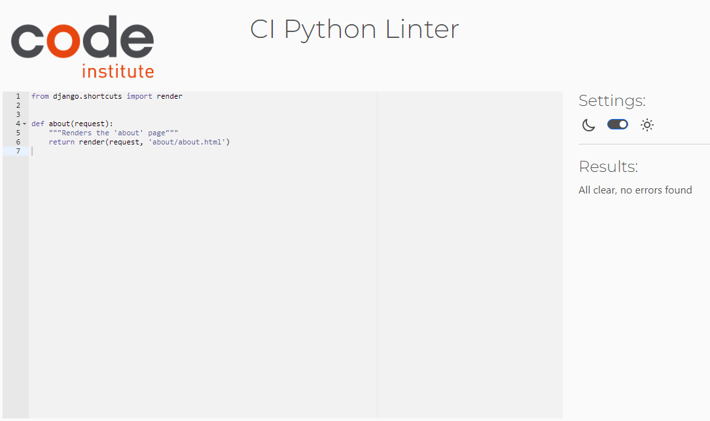
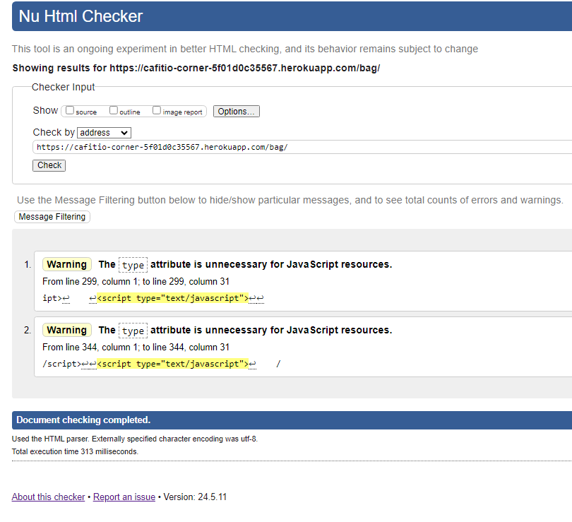
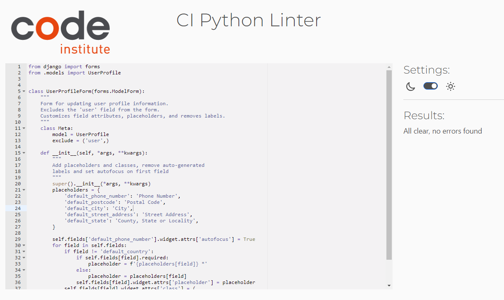
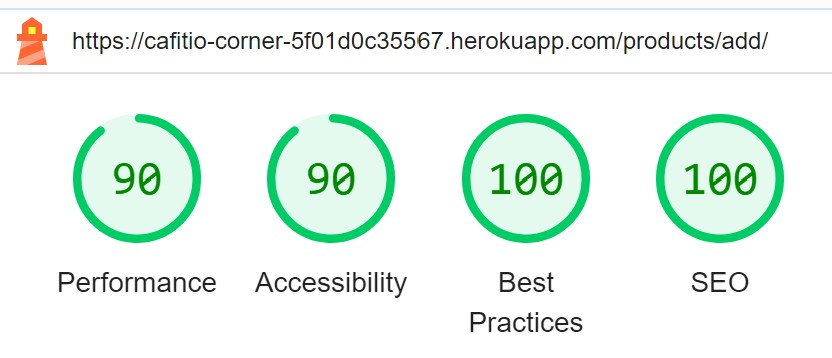

# Testing Documentation

This document provides a comprehensive overview of the testing procedures and outcomes for the Cafitio Corner project. It includes validation of user stories, code validation, accessibility testing, tools used, and manual testing for browser and device compatibility.

## Table of Contents

1. [Testing User Stories](#testing-user-stories)
2. [Code Validation](#code-validation)
3. [Accessibility](#accessibility)
4. [Tools Testing](#tools-testing)
5. [Manual Testing](#manual-testing)

## Testing User Stories

User stories are documented in the Cafitio Corner GitHub Projects Board. Each user story includes detailed Acceptance Criteria and Tasks. Testing was conducted using Dev Tools for desktop, tablet, and mobile to ensure that all Acceptance Criteria were met. All features were thoroughly tested to verify that they provided the expected output and actions for the user.

| User Story                                                                                                        | Acceptance Criteria Met? | Tested                       | Response                                                                                      | Pass/Fail |
|-------------------------------------------------------------------------------------------------------------------|--------------------------|-----------------------------|-----------------------------------------------------------------------------------------------|-----------|
| As a site user, I can easily access my user profile and make necessary edits to ensure all information is kept up to date. | Yes                      | Desktop, Tablet, Mobile     | User profile is easily accessible and editable, all information updates correctly.             | Pass      |
| As a shopper, I want to receive the order confirmation by email so that it will prove that the order has been successfully placed. | Yes                      | Desktop, Tablet, Mobile     | Order confirmation emails are sent successfully after placing an order.                        | Pass      |
| As a site user, I can create an account so that I can place orders.                                                | Yes                      | Desktop, Tablet, Mobile     | Account creation process works smoothly, users can create accounts and place orders.           | Pass      |
| As a site owner, I can delete products so that I ensure the store offers only available items to the customers to browse and purchase. | Yes                      | Desktop, Tablet, Mobile     | Products can be deleted successfully, ensuring only available items are displayed.             | Pass      |
| As a site owner, I can edit the products so that I provide up-to-date information for the customers.               | Yes                      | Desktop, Tablet, Mobile     | Products can be edited and updated information is displayed correctly.                         | Pass      |
| As a shopper, I want to rate products so that I can provide specific feedback based on my experience, helping other shoppers make informed decisions. | Yes                      | Desktop, Tablet, Mobile     | Product rating functionality works correctly, users can rate products and feedback is displayed. | Pass      |
| As a site user, I can leave, edit, and delete the reviews I've submitted so that I can share my experiences accurately and manage my feedback as needed. | Yes                      | Desktop, Tablet, Mobile     | Users can leave, edit, and delete reviews successfully, ensuring accurate feedback management. | Pass      |
| As a site user, I can view product reviews from other users to make informed decisions before purchasing.          | Yes                      | Desktop, Tablet, Mobile     | Product reviews are displayed correctly, helping users make informed purchase decisions.        | Pass      |
| As a site user, I can easily reset the password in case I forget it so that I can have access to my account.       | Yes                      | Desktop, Tablet, Mobile     | Password reset functionality works correctly, allowing users to regain access to their accounts. | Pass      |
| As a site user, I can seamlessly log in and log out so that I can access my profile whenever needed.               | Yes                      | Desktop, Tablet, Mobile     | Users can log in and log out seamlessly, accessing their profiles as needed.                    | Pass      |
| As a site user, I can access my account so that I can see the order history.                                       | Yes                      | Desktop, Tablet, Mobile     | Order history is accessible to users, displaying past orders correctly.                         | Pass      |
| As a site owner, I can add new products so that I expand the store offerings.                                      | Yes                      | Desktop, Tablet, Mobile     | New products can be added successfully, expanding the store's offerings.                        | Pass      |
| As a site user, I want to view all the products so that I can choose what to purchase.                             | Yes                      | Desktop, Tablet, Mobile     | All products are viewable, allowing users to browse and choose items to purchase.               | Pass      |
| As a shopper, I want the convenience of having my personal details saved in the checkout form so that future purchases are streamlined. | Yes                      | Desktop, Tablet, Mobile     | Personal details are saved in the checkout form, streamlining future purchases.                 | Pass      |
| As a site user, I can easily click on a product to view so that I can see the product image bigger and the product description. | Yes                      | Desktop, Tablet, Mobile     | Clicking on a product displays a larger image and detailed description.                         | Pass      |
| As a user, I can add multiple products to the basket so that I can make a single payment.                          | Yes                      | Desktop, Tablet, Mobile     | Multiple products can be added to the basket, allowing a single payment for all items.          | Pass      |
| As a site user, I can access the product description so that I can gather essential information about the product before making a decision. | Yes                      | Desktop, Tablet, Mobile     | Product descriptions are accessible, providing essential information to users.                  | Pass      |
| As a shopper, I want to add multiple categories of products simultaneously so that I can compare prices or ratings across diverse products. | Yes                      | Desktop, Tablet, Mobile     | Multiple product categories can be added simultaneously, facilitating comparisons.              | Pass      |
| As a site user, I can select what category of products I want to see so that I can view only the category needed.  | Yes                      | Desktop, Tablet, Mobile     | Users can filter products by category, viewing only the desired items.                           | Pass      |
| As a user, I want to be able to search for product names or descriptions so that I can quickly locate the specific items I wish to purchase. | Yes                      | Desktop, Tablet, Mobile     | Search functionality works correctly, allowing users to locate specific items quickly.           | Pass      |
| As a shopper, I want to sort ratings and reviews so that I can quickly identify the higher ratings and newest reviews. | Yes                      | Desktop, Tablet, Mobile     | Ratings and reviews can be sorted, helping users identify higher ratings and newest feedback.    | Pass      |
| As a shopper, I want to effortlessly view the total amount of the items in my basket at any time so that I can manage my budget. | Yes                      | Desktop, Tablet, Mobile     | The total amount in the basket is displayed, allowing users to manage their budget effectively.   | Pass      |
| As a shopper, I can view and update the basket items quantity so that I can have control over my shopping.         | Yes                      | Desktop, Tablet, Mobile     | Basket item quantities can be viewed and updated, providing control over shopping.               | Pass      |
| As a site user, I can add multiple quantities of the same product to the basket, so that will facilitate bulk purchases and simplify my shopping experience. | Yes                      | Desktop, Tablet, Mobile     | Multiple quantities of the same product can be added to the basket, simplifying bulk purchases.  | Pass      |
| As a shopper, I want assurance that my personal and payment information is secure so that I can confidently complete purchases. | Yes                      | Desktop, Tablet, Mobile     | Personal and payment information is secure, allowing users to confidently complete purchases.     | Pass      |
| As a shopper, I want to view the order confirmation after the checkout so that I can review the items I ordered.   | Yes                      | Desktop, Tablet, Mobile     | Order confirmation is displayed after checkout, allowing users to review ordered items.           | Pass      |
| As a site owner, I want to offer newsletter subscriptions to users so that we can ensure ongoing communication, sharing offers and inspiration, thereby encouraging their return visits. | Yes                      | Desktop, Tablet, Mobile     | Newsletter subscriptions can be offered to users, ensuring ongoing communication and engagement.  | Pass      |

## Code Validation 

The following tools and websites were used to validate the code:

- W3C Markup Validator: Used to validate HTML files.
  - [W3C Markup Validator](https://validator.w3.org/)
- W3C CSS Validator: Used to validate CSS files.
  - [W3C CSS Validator](https://jigsaw.w3.org/css-validator/)
- JSHint: Used to validate JavaScript files.
  - [JSHint](https://jshint.com/)
- PEP8 Online Checker: Used to validate Python files for PEP8 compliance.
  - [PEP8 CI](https://pep8ci.herokuapp.com/)

### About

| File Name  | Type   | Validation Tool | Validation Result | Issues Found | Status | Screenshot |
|------------|--------|-----------------|-------------------|--------------|--------|------------|
| about.css  | CSS    | W3C Validator   | No issues         | None         | Pass   |  |
| about.html | HTML   | W3C Validator   | No issues         | None         | Pass   |  |
| urls.py    | Python | PEP8            | No issues         | None         | Pass   |  |
| views.py   | Python | PEP8            | No issues         | None         | Pass   |  |

### Bag App

| File Name       | Type   | Validation Tool | Validation Result | Issues Found | Status | Screenshot |
|-----------------|--------|-----------------|-------------------|--------------|--------|------------|
| bag_tools.py    | Python | PEP8            | No issues         | None         | Pass   |  |
| contexts.py     | Python | PEP8            | No issues         | None         | Pass   |  |
| bag.html        | HTML   | W3C Validator   | No issues         | None         | Pass   |  |
| urls.py         | Python | PEP8            | No issues         | None         | Pass   |  |
| view.py         | Python | PEP8            | No issues         | None         | Pass   |  |

### Cafitio Corner Project

| File Name   | Type   | Validation Tool | Validation Result       | Issues Found                     | Status | Screenshot |
|-------------|--------|-----------------|-------------------------|----------------------------------|--------|------------|
| settings.py | Python | PEP8            | Issues found             | Some lines too long        | Failed   |  |
| urls.py     | Python | PEP8            | No issues               | None                             | Pass   |  |
| views.py    | Python | PEP8            | No issues               | None                             | Pass   |  |

### Checkout App

| File Name             | Type   | Validation Tool | Validation Result       | Issues Found                     | Status | Screenshot |
|-----------------------|--------|-----------------|-------------------------|----------------------------------|--------|------------|
| admin.py              | Python | PEP8            | No issues               | None                             | Pass   |  |
| checkout.css          | CSS    | W3C Validator   | No issues               | None                             | Pass   |  |
| checkout.html         | HTML   | W3C Validator   | No issues               | None                             | Pass   |  |
| forms.py              | Python | PEP8            | No issues               | None                             | Pass   |  |
| models.py             | Python | PEP8            | No issues               | None                             | Pass   |  |
| signals.py            | Python | PEP8            | No issues               | None                             | Pass   |  |
| stripe_elements.js    | JS     | JSHint          | No issues               | None                             | Pass   |  |
| urls.py               | Python | PEP8            | No issues               | None                             | Pass   |  |
| views.py              | Python | PEP8            | No issues               | None                             | Pass   |  |
| webhooks.py           | Python | PEP8            | No issues               | None                             | Pass   |  |
| webhook_handler.py    | Python | PEP8            | No issues               | None                             | Pass   |  |

### Contact App

| File Name        | Type   | Validation Tool | Validation Result | Issues Found | Status | Screenshot |
|------------------|--------|-----------------|-------------------|--------------|--------|------------|
| admin.py         | Python | PEP8            | No issues         | None         | Pass   |  |
| contact.html     | HTML   | W3C Validator   | No issues         | None         | Pass   |  |
| forms.py         | Python | PEP8            | No issues         | None         | Pass   |  |
| models.py        | Python | PEP8            | No issues         | None         | Pass   |  |
| tests_forms.py   | Python | PEP8            | No issues         | None         | Pass   |  |
| tests_views.py   | Python | PEP8            | No issues         | None         | Pass   |  |
| urls.py          | Python | PEP8            | No issues         | None         | Pass   |  |
| views.py         | Python | PEP8            | No issues         | None         | Pass   |  |

### Home

| File Name  | Type   | Validation Tool | Validation Result | Issues Found | Status | Screenshot |
|------------|--------|-----------------|-------------------|--------------|--------|------------|
| index.html       | HTML   | W3C Validator   | No issues         | None         | Pass   |  |
| urls.py    | Python | PEP8            | No issues         | None         | Pass   |  |
| views.py   | Python | PEP8            | No issues         | None         | Pass   |  |

### Products App

| File Name                      | Type   | Validation Tool | Validation Result | Issues Found | Status | Screenshot |
|--------------------------------|--------|-----------------|-------------------|--------------|--------|------------|
| admin.py                       | Python | PEP8            | No issues         | None         | Pass   |  |
| delete-modal.js                | JS     | JSHint          | No issues         | None         | Pass   |  |
| dropdown.js                    | JS     | JSHint          | No issues         | None         | Pass   |  |
| forms.py                       | Python | PEP8            | No issues         | None         | Pass   |  |
| add_products.html              | HTML   | W3C Validator   | No issues         | None         | Pass   |  |
| edit_products.html             | HTML   | W3C Validator   | No issues         | None         | Pass   |  |
| products.html                  | HTML   | W3C Validator   | No issues         | None         | Pass   |  |
| models.py                      | Python | PEP8            | No issues         | None         | Pass   |  |
| my_filters.py                  | Python | PEP8            | No issues         | None         | Pass   |  |
| products.css                   | CSS    | W3C Validator   | No issues         | None         | Pass   |  |
| quantity_input_script.html (js)| JS     | JSHint          | No issues         | None         | Pass   | .png) |
| reviews.js                     | JS     | JSHint          | No issues         | None         | Pass   |  |
| test_review_views.py           | Python | PEP8            | No issues         | None         | Pass   |  |
| urls.py                        | Python | PEP8            | No issues         | None         | Pass   |  |
| views.py                       | Python | PEP8            | No issues         | None         | Pass   |  |
| widgets.py                     | Python | PEP8            | No issues         | None         | Pass   |  |

### Profiles App

| File Name        | Type   | Validation Tool | Validation Result | Issues Found | Status | Screenshot |
|------------------|--------|-----------------|-------------------|--------------|--------|------------|
| countryfields.js | JS     | JSHint          | No issues         | None         | Pass   |  |
| forms.py         | Python | PEP8            | No issues         | None         | Pass   |  |
| profile.html     | HTML   | W3C Validator   | No issues         | None         | Pass   |  |
| models.py        | Python | PEP8            | No issues         | None         | Pass   |  |
| profile.css      | CSS    | W3C Validator   | No issues         | None         | Pass   |  |
| urls.py          | Python | PEP8            | No issues         | None         | Pass   |  |
| views.py         | Python | PEP8            | No issues         | None         | Pass   |  |

### Wishlist App

| File Name        | Type   | Validation Tool | Validation Result | Issues Found | Status | Screenshot |
|------------------|--------|-----------------|-------------------|--------------|--------|------------|
| wishlist.html    | HTML   | W3C Validator   | No issues         | None         | Pass   |  |
| models.py        | Python | PEP8            | No issues         | None         | Pass   |  |
| tests_views.py   | Python | PEP8            | No issues         | None         | Pass   |  |
| urls.py          | Python | PEP8            | No issues         | None         | Pass   |  |
| views.py         | Python | PEP8            | No issues         | None         | Pass   |  |

### Base

| File Name  | Type   | Validation Tool | Validation Result | Issues Found | Status | Screenshot |
|------------|--------|-----------------|-------------------|--------------|--------|------------|
| base.css   | CSS    | W3C Validator   | No issues         | None         | Pass   |  |
| base.js    | JS     | JSHint          | No issues         | None         | Pass   |  |

### Flake8 Issues

Additionally, I used Flake8 for Python code validation. The following issues were found:

- Issues
  - 
  - 
  - 

- Unfixed Issues
  - 
  - 

The reason for not fixing some of these issues is because they are part of Django code, migrations, or code provided by Code Institute.

## Accessibility

To ensure the website is easy to read and accessible, Lighthouse in Chrome DevTools was used to analyze the colors, fonts, and overall accessibility of the site. The reports for each page are shown in the table below:

| Page                  | Screenshot |
|-----------------------|------------|
| About                 |  |
| Add Product           |  |
| Bag                   |  |
| Checkout Success      |  |
| Checkout              |  |
| Contact               |  |
| Edit Product          |  |
| Home                  |  |
| Product Information   |  |
| Products              |  |
| Profile               |  |
| Wishlist              |  |

### Notes

The Lighthouse reports were generated after the deployment of the project. Due to time constraints, some issues identified in the reports have not yet been addressed. These issues primarily relate to performance optimizations such as image sizes and server response times. Despite these areas for improvement, the project demonstrates a strong adherence to accessibility standards, best practices, and SEO optimization.

## Tools Testing

### Chrome DevTools
Chrome DevTools was used extensively during the development process to test, explore, and modify HTML elements and CSS styles used in the project.

### Responsiveness
Chrome DevTools was also utilized to test the responsiveness of the website on different screen sizes, ensuring that the site is accessible and functional across a variety of devices.

## Manual Testing

### Browser Compatibility

| Browser         | Outcome                                       | Pass/Fail |
|-----------------|-----------------------------------------------|-----------|
| Google Chrome   | No issues with appearance, responsiveness, or functionality. | Pass      |
| Safari          | No issues with appearance, responsiveness, or functionality. | Pass      |
| Microsoft Edge  | No issues with appearance, responsiveness, or functionality. | Pass      |

### Device Compatibility

| Device                    | Operative Outcome                                    | Pass/Fail |
|---------------------------|------------------------------------------------------|-----------|
| Samsung S22 Ultra         | No issues with appearance, responsiveness, or functionality. | Pass      |
| iPhone 15 Pro Max         | No issues with appearance, responsiveness, or functionality. | Pass      |
| Samsung Galaxy Tab A7     | No issues with appearance, responsiveness, or functionality. | Pass      |
| Microsoft Surface X       | Used to develop the project. No issues encountered.         | Pass      |

### Email Functionality Testing

| Test                          | Expected Outcome                                                                 | Pass/Fail |
|-------------------------------|----------------------------------------------------------------------------------|-----------|
| Sign-Up Email Confirmation    | Real emails are sent to users upon sign-up, containing a confirmation link.       | Pass      |
| Password Reset Email          | Real emails are sent to users for password reset, containing a reset link.        | Pass      |
| Order Confirmation Email      | Real emails are sent to users after placing an order, containing order details.   | Pass      |

## Testing

### General

| Test                           | Outcome                                                                              | Pass/Fail |
|--------------------------------|--------------------------------------------------------------------------------------|-----------|
| Navigation Links               | All navigation links function correctly.                                             | Pass      |
| Responsive Design              | The website adjusts correctly to different screen sizes.                             | Pass      |
| Forms                          | All forms submit data correctly and display appropriate success/error messages.      | Pass      |
| Accessibility                  | All interactive elements are accessible via keyboard navigation.                     | Pass      |
| Performance                    | The website loads quickly and performs well across devices and browsers.             | Pass      |
| Subscribe and Unsubscribe      | Subscribe and unsubscribe functionality works correctly, with the modal appearing when attempting to unsubscribe. Email is also visible in the admin panel. | Pass      |
| Search Bar                     | Search bar works correctly, displaying the items if they are on the website. Clicking on a product opens the product information. | Pass      |
| Links to Product Page          | All links redirect correctly to the product page.                                     | Pass      |
| Links to About Page            | All links redirect correctly to the about page.                                       | Pass      |
| Links to Contact Page          | All links redirect correctly to the contact page.                                     | Pass      |
| Links to Bag                   | All links redirect correctly to the bag.                                              | Pass      |
| User Links (Log In, Register, Log Out and Product Management) | All user-related links function correctly for log in, register, and log out.   | Pass      |
| Product Management Links       | All links for product management work correctly.                                      | Pass      |
| Footer Links                   | All footer links function correctly.                                                  | Pass      |
| Confirmation/Information Messages | Confirmation/information messages are visible when adding items to the bag, updating quantity, editing products, adding new products, etc., and they automatically close after 5 seconds. | Pass      |
| Modal Functionality            | The modal works correctly when trying to delete products and unsubscribe.             | Pass      |

### Individual Page Tests

#### Home Page

| Test               | Outcome                                              | Pass/Fail |
|--------------------|------------------------------------------------------|-----------|
| Hero Image and Text| Hero image and text are displayed correctly.         | Pass      |
| Buttons and Links  | All buttons and links work correctly.                | Pass      |

#### Products Page

| Test                       | Outcome                                                                 | Pass/Fail |
|----------------------------|-------------------------------------------------------------------------|-----------|
| Product Listings           | All products are displayed with correct information.                    | Pass      |
| Product Navigation Bar Links| Clicking any of the links will filter the products in that category.    | Pass      |
| Filter and Sort            | Filter and sort options work correctly.                                 | Pass      |
| Wishlist                   | Adding/removing items from the wishlist works correctly, changing from an empty heart to a full heart. | Pass      |
| Admin Edit/Delete Buttons  | Edit and delete buttons for admin are displayed and working correctly.  | Pass      |
| Product Count              | Product count is working and has been tested on all categories and individual categories. | Pass      |
| Pagination Buttons         | Pagination buttons have been tested and are correctly changing the page. | Pass      |

#### Product Details Page

| Test                       | Expected Outcome                                                                           | Pass/Fail |
|----------------------------|--------------------------------------------------------------------------------------------|-----------|
| Product Navigation Bar Links | Clicking any of the links redirects to the products page and filters the products in that category. | Pass      |
| Heart Icon                  | Clicking the empty heart icon adds the product to the wishlist and fills the heart; clicking the filled heart icon removes the product from the wishlist and redirects to the wishlist. | Pass      |
| Product Edit Button         | Clicking the button redirects to the edit product page.                                    | Pass      |
| Product Delete Button       | Clicking the button deletes the product from the database.                                 | Pass      |
| Decrease Quantity Button    | Clicking the button decreases the quantity on the input form.                              | Pass      |
| Increase Quantity Button    | Clicking the button increases the quantity on the input form.                              | Pass      |
| Cart Icon                   | Clicking the icon adds the specified quantity of the product to the shopping cart.         | Pass      |
| Rating and Reviews          | Both are working well. Only the same user can edit and delete the review and rating left.  | Pass      |

#### Add Product Page

| Test                   | Expected Outcome                                                         | Pass/Fail |
|------------------------|---------------------------------------------------------------------------|-----------|
| Add Product Form       | Upon form submission, the product is successfully added to the database.  | Pass      |
| Select Image Button    | Clicking this button allows the user to upload an image for the product.  | Pass      |
| Cancel Button          | Clicking this button navigates back to the products page without saving.  | Pass      |
| Mandatory Fields       | Product cannot be added if the mandatory fields are not filled in, preventing submission. | Pass      |

#### Edit Product Page

| Test                   | Expected Outcome                                                         | Pass/Fail |
|------------------------|---------------------------------------------------------------------------|-----------|
| Edit Product Form      | Upon form submission, the product is updated in the database and the user is redirected to the product detail page. | Pass      |
| Select Image Button    | Clicking this button allows the user to upload or change the product image. | Pass      |
| Cancel Button          | Clicking this button navigates back to the products page without saving changes. | Pass      |

#### Bag Page

| Test                   | Expected Outcome                                                         | Pass/Fail |
|------------------------|---------------------------------------------------------------------------|-----------|
| Decrease Quantity Button | Reduces the quantity of the product in the shopping cart.                | Pass      |
| Increase Quantity Button | Increases the quantity of the product in the shopping cart.              | Pass      |
| Update Button            | Updates the product quantity in the shopping cart when clicked.           | Pass      |
| Remove Button            | Removes the product from the shopping cart when clicked.                  | Pass      |
| Keep Shoping Button      | Redirects the user to the products page.                                  | Pass      |
| Secure Checkout Button   | Redirects the user to the checkout page to complete the purchase.         | Pass      |

#### Checkout Page

| Test                     | Expected Outcome                                                                            | Pass/Fail |
|--------------------------|----------------------------------------------------------------------------------------------|-----------|
| Form Fields              | Order is submitted successfully, and confirmation is displayed.                              | Pass      |
| Payment Integration      | Payment is processed correctly.                                                              | Pass      |
| Save Information Checkbox| When checked, updates the user's profile information during the checkout process.            | Pass      |
| Adjust Bag Button          | Clicking the button redirects to the shopping bag page.                                        | Pass      |
| Mandatory Fields         | Payment cannot be processed if all the mandatory fields are not filled in, preventing submission. | Pass      |
| Payment Alert Message    | Payment alert message works correctly if the card payment details are entered incorrectly.   | Pass      |

#### Checkout Success Page

| Test                     | Expected Outcome                                                                            | Pass/Fail |
|--------------------------|----------------------------------------------------------------------------------------------|-----------|
| Continue Shopping Button | Clicking the button redirects to the products page.                                          | Pass      |

#### Profile Page

| Test               | Outcome                                              | Pass/Fail |
|--------------------|------------------------------------------------------|-----------|
| Profile Information| Profile information is displayed correctly.          | Pass      |
| Edit Profile       | Profile information is updated successfully.         | Pass      |
| Order Link             | Clicking the link redirects to the order view.     | Pass      |

#### Wishlist Page

| Test               | Outcome                                              | Pass/Fail |
|--------------------|------------------------------------------------------|-----------|
| Add to Wishlist    | Products are successfully added to the wishlist.     | Pass      |
| Remove from Wishlist| Products are successfully removed from the wishlist.| Pass      |
| Product Image              | Clicking on the product image redirects to the product information page.                   | Pass     

#### Contact Us Page

| Test               | Outcome                                              | Pass/Fail |
|--------------------|------------------------------------------------------|-----------|
| Contact Form       | Form submits successfully, and confirmation is displayed. | Pass      |
| Form Validation    | Validation messages are displayed correctly.         | Pass      |
| Mandatory Fields   | Form cannot be submitted if the mandatory fields are not filled in, preventing submission. | Pass      |

#### About Page

| Element                | Expected Outcome                                                         | Pass/Fail |
|------------------------|---------------------------------------------------------------------------|-----------|
| Page Content           | All about page content is displayed correctly.                            | Pass      |

### 404 Page

| Test               | Outcome                                                                             | Pass/Fail |
|--------------------|--------------------------------------------------------------------------------------|-----------|
| 404 Page Display   | 404 page is displayed correctly when a non-existent link is entered.                 | Pass      |
